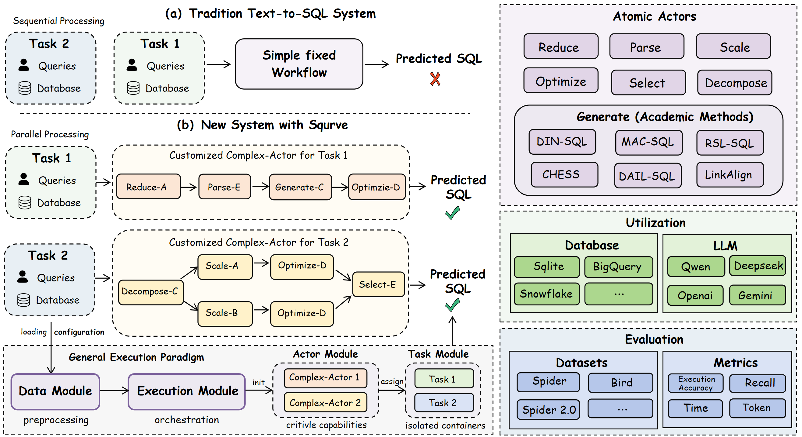

# SqurveBridge

An extensible, reproducible, and analysis-oriented research framework for Text-to-SQL.

The rapid growth of Text-to-SQL methods and benchmarks makes faithful reproduction
increasingly expensive: each method introduces its own data layout, prompting
pipeline, model interface, and evaluation scripts, while reported aggregate scores
often hide where a system succeeds or fails. SqurveBridge addresses this problem
with a unified Actor abstraction for composing community methods as native,
inspectable workflows; a reproducibility pipeline that records stage outputs,
execution traces, token usage, and evaluation artifacts; and an interactive
workbench for comparing predictions, schema-linking decisions, and failure slices.
The framework is designed both for running established evaluations and for rapidly
developing and validating new Text-to-SQL strategies without coupling experiments
to candidate repositories.

SqurveBridge bundles **Spider** and **BIRD**, includes reproducible configurations
for representative methods, and ships the runtime, evaluation harness, integration
contracts, and visual demo as one standalone project. Bring your own LLM API key;
no credentials are embedded in the repository.

## Highlights

- **Unified method composition.** Actor and Task interfaces express parsing,
  schema reduction, generation, optimization, selection, and agent workflows.
- **Evidence-rich evaluation.** Final and stage-level metrics are paired with
  workflow traces, SQL feature slices, consistency diagnostics, latency, and token
  accounting.
- **Reproducible integration.** Contract-driven adapters turn community algorithms
  into native Squrve implementations instead of depending on candidate source trees.
- **Interactive analysis.** The local workbench exposes inputs, intermediate
  decisions, predictions, and evaluation results in one review surface.



## Quick start

Requires Python 3.11+ and Node.js 20+.

```bash
cd SqurveBridge
python3 -m venv .venv
source .venv/bin/activate
pip install -r requirements.txt
cp .env.example .env
# Edit .env and set QWEN_API_KEY for the bundled example configs
```

### Live demo (recommended)

```bash
./demo/start.sh
```

Open the printed local URL (typically `http://127.0.0.1:5173`).
In the UI, use **Configure LLM** to paste your API key if you prefer not to use `.env`.

Defaults are `spider` / `dev` / `c3sql`.

### CLI reproduce

```bash
python reproduce/run.py spider c3sql
```

Optional BIRD smoke configuration:

```bash
python reproduce/run.py bird e-sql-smoke
```

Additional Spider and BIRD configs are under `reproduce/configs/`.

## Agent harness (optional)

SqurveBridge ships the ARIS-style skill contracts used for method/dataset integration:

```text
skills/      SKILL.md workflows
tools/       deterministic helpers (artifact_state, verify, …)
templates/   reusable text artifacts
harness/     install / sync scripts
```

Install local agent symlinks (Claude Code / Codex):

```bash
bash harness/install_squrve_harness.sh .
bash harness/update_squrve_harness.sh --project .
```

## Layout

| Path | Role |
|------|------|
| `core/` | Runtime (actors, engine, evaluator) |
| `benchmarks/spider/`, `benchmarks/bird/` | Bundled public benchmarks |
| `reproduce/` | CLI runner + Spider/BIRD configs |
| `demo/` + `demo-app/` | Live demo API + React UI |
| `config/sys_config.json` | Spider/BIRD benchmark registry |
| `skills/` `tools/` `templates/` `harness/` | Integration agent harness |

## Credentials

Use `.env.example` → `.env`. Never commit real keys.

Supported placeholders include `DEEPSEEK_API_KEY`, `QWEN_API_KEY`, `OPENAI_API_KEY`, and others listed in `.env.example`.

## Docs

- [Getting Started](docs/GETTING_STARTED.md)
- [Reproducibility](docs/REPRODUCIBILITY.md)

## License

MIT — see [LICENSE](LICENSE).
