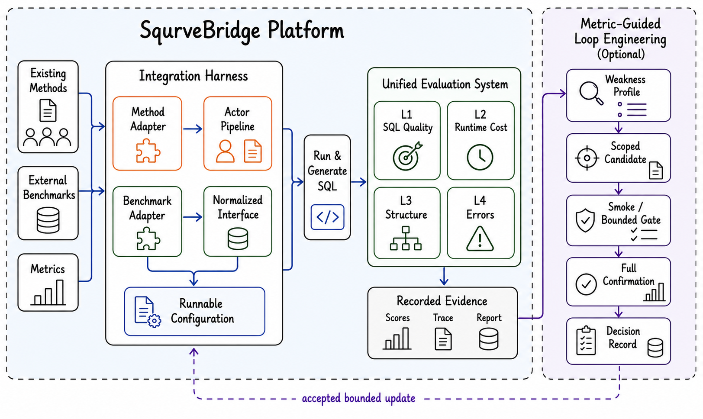

# SqurveBridge

<div align="center">

### Turn released Text-to-SQL methods and databases into reproducible, diagnosable Squrve workflows

**Integrate · Reproduce · Diagnose · Improve**

[](https://www.python.org/)
[](LICENSE)
[](https://github.com/Satissss/Squrve)
[](demo/README_EN.md)
[](docs/REPRODUCIBILITY.md)

[Why SqurveBridge?](#more-than-a-runner) · [Quick Start](#quick-start) · [Capabilities](#core-capabilities) · [Workflow](#workflow) · [Demo](#interactive-demo) · [Documentation](#documentation)

</div>

---

Text-to-SQL repositories often stop where cross-domain engineering begins. A
released method may assume one schema format, one database layout, one prompt
stack, and one evaluator. Moving it to another benchmark then becomes a second
implementation project whose decisions are difficult to compare or reproduce.

SqurveBridge turns that hidden work into an explicit system. It reconstructs
released algorithms as inspectable Squrve-native Actor workflows, normalizes
benchmarks behind one contract, runs method–database pairs through reproducible
configurations, and persists enough evidence to localize failures by sample and
stage. Optional Meta-Evo tooling can then evaluate bounded changes against the
same recorded baseline.

SqurveBridge is not another Text-to-SQL model. It is the bridge between released
methods, new databases, and trustworthy evaluation.

## More Than a Runner

A script can launch an experiment. SqurveBridge preserves the engineering chain
that makes the experiment understandable:

```text
released method or benchmark
        ↓
candidate understanding
        ↓
contract-gated native integration
        ↓
reproduce configuration
        ↓
sample- and stage-localizable run
        ↓
score bundle + traces + report
        ↓
optional bounded improvement loop
```

The platform is built on the modular Actor, Task, workflow, and runtime
foundations of upstream [Squrve](https://github.com/Satissss/Squrve).
SqurveBridge adds the integration harness, cross-domain reproduce layer,
diagnostic artifact contract, controlled improvement tooling, and interactive
workspace maintained in this repository.

## Quick Start

### 1. Prepare the repository

From a local checkout of this repository:

```bash
git lfs install
git lfs pull --include="benchmarks/packages/*.zip"
python3 -m venv .venv
source .venv/bin/activate
pip install -r requirements.txt
```

Python 3.11 or newer is required. The interactive workspace additionally uses
Node.js 20 or newer.

### 2. Verify and install benchmark packages

Spider and BIRD are distributed as manifest-governed Git LFS archives:

```bash
python tools/benchmarks.py verify-archives
python tools/benchmarks.py install spider
python tools/benchmarks.py install bird
```

### 3. Run deterministic checks

The standard gate does not call an LLM:

```bash
python tools/release_check.py --skip-history
```

It checks public-surface anonymity, secret safety, benchmark pointers,
reproduce contracts, release metadata, documentation links, and Python
regressions. The full gate also verifies payloads and builds distributable
artifacts:

```bash
python tools/release_check.py --full
```

### 4. Run a configured workflow

```bash
cp .env.example .env
# Add the provider credential required by the selected configuration.
python reproduce/run.py spider c3sql
```

Another bundled configuration targets BIRD:

```bash
python reproduce/run.py bird e-sql-smoke
```

Remote model calls may incur cost. Inspect the configuration, sample scope, and
concurrency before launching a large run. See
[Getting Started](docs/GETTING_STARTED.md) for the complete setup path.

## Core Capabilities

| Capability | What SqurveBridge makes explicit |
| --- | --- |
| **Native method integration** | Released algorithm logic is reconstructed as Squrve Actors instead of executed as an opaque external repository. |
| **Benchmark and database adapters** | Schema, questions, SQL, database files, splits, credentials, and evaluator assumptions converge on one interface. |
| **Reproduce contracts** | One configuration binds method, benchmark, workflow, provider, sampling, execution, and evaluation settings. |
| **Four-layer evidence** | SQL quality, runtime cost, structural behavior, and deterministic error attribution stay connected to the run that produced them. |
| **Localizable debugging** | Stage snapshots, workflow traces, completed IDs, and checkpoints expose where a pipeline failed or resumed. |
| **Bounded Meta-Evo** | Recorded artifacts can seed constrained candidate evaluation with smoke gates, regression monitors, and human promotion. |
| **Embedded Pi Agent** | Vendored Pi source provides the native Agent backend; repository Skills load directly into Pi without Claude Code or Codex. |
| **Interactive workspace** | SQL Studio, Experiment Board, and Archive connect live execution with persisted evidence. |

## Workflow

The repository provides Pi-native Agent Skills for the complete integration path:

```text
/skill:candidate-reader <released-method-or-benchmark>
  → /skill:integration-pipeline <slug>
  → /skill:run <dataset> <method>
  → optional /skill:evaluator-report
  → optional /skill:meta-evo
```

1. **Understand the candidate.** `/skill:candidate-reader` records algorithm stages,
   data assumptions, prompts, providers, and integration boundaries in a
   machine-checkable manifest.
2. **Integrate natively.** `/skill:integration-pipeline` dispatches focused adapters
   for Actors, workflow registration, schema, retrieval, providers, databases,
   and reproduce configuration.
3. **Run to completion.** `/skill:run` debugs the real configuration, preserves
   checkpoints, and writes score bundles and traces rather than relying on chat
   history.
4. **Inspect the evidence.** `/evaluator-report` summarizes the run and makes
   missing measurements explicit.
5. **Improve only when justified.** `/skill:meta-evo` evaluates bounded candidates
   from persisted evidence and leaves promotion to human review.

Candidate repositories are algorithm references, not runtime dependencies. The
integration contract and artifact lifecycle are documented in the
[Integration Harness](harness/README.md).

## System Architecture



The system has three cooperating planes:

- **Integration plane:** candidate manifests, fine-grained adapters, Actor
  implementations, workflow registration, benchmark normalization, and config
  validation.
- **Execution and evidence plane:** reproduce runners, checkpoint isolation,
  evaluator layers, workflow traces, reports, and the evaluation store.
- **Interaction and improvement plane:** the local Demo App, restricted hosted
  demo surfaces, diagnostic reports, and optional Meta-Evo orchestration.

Every plane shares a single rule: claims come from persisted artifacts. Missing
runtime evidence is reported as missing; it is never invented from configuration
or presentation data.

## Artifact Contract

A completed run connects one concrete configuration to aggregate and
sample-level evidence:

```text
method + benchmark + provider + sampling
  → Actor workflow
  → checkpoints and stage snapshots
  → scores.json
     L1  SQL quality
     L2  token and latency evidence
     L3  SQL-component behavior
     L4  deterministic error attribution
  → workflow trace + report + evaluation store
```

The exact metrics available depend on the selected evaluator and recorded run.
SqurveBridge does not synthesize a score, token count, or trace when its source
artifact is absent. Sanitized example bundles under
[`evidence/reported-results/`](evidence/reported-results/) demonstrate the
verification contract without redistributing questions, database rows, SQL text,
provider payloads, credentials, or local filesystem paths.

## Interactive Demo

Start the full local workspace from the repository root:

```bash
./demo/start.sh
```

Open `http://127.0.0.1:5173` and use:

- **SQL Studio** to select a method and benchmark, inspect the Actor workflow,
  and execute SQL through the local backend.
- **Experiment Board** to compare persisted quality, cost, structure, and error
  evidence under one protocol.
- **Archive** to inspect score bundles, traces, reports, and run metadata.

The local API binds to `127.0.0.1` by default. The embedded Pi backend has full
coding tools only in a trusted local environment. A restricted hosted bundle is
also supported for public demonstrations; hosted Pi sessions are read-only and
cannot access files outside the bundled repository. See the
[Demo guide](demo/README_EN.md) and
[hosted bundle metadata](deploy/huggingface/README.space.md).

## Project Layout

| Path | Responsibility |
| --- | --- |
| `core/` | Shared Squrve runtime extensions and native Actor workflows |
| `benchmarks/` | Versioned packages and normalized benchmark interfaces |
| `reproduce/configs/` | Runnable method–benchmark configurations |
| `reproduce/lib/` | Run isolation, checkpoints, sampling, and artifact helpers |
| `reproduce/eval/`, `reproduce/metrics/` | Evaluation layers and score-bundle assembly |
| `skills/` | Human-readable integration and execution contracts |
| `tools/` | Deterministic validation, packaging, security, and release gates |
| `templates/` | Reusable manifests, configs, reports, and artifact schemas |
| `demo/`, `demo-app/` | Local backend and interactive frontend |
| `deploy/` | Restricted hosted-demo packaging and deployment surfaces |
| `evidence/` | Sanitized, checksummed example evidence bundles |

## Verification and Safety

Before publishing changes, run:

```bash
python tools/anonymity_scan.py
python tools/security_scan.py
python tools/benchmarks.py verify-pointers
python -m unittest discover -s tests -p 'test_*.py' -v
```

For a local double-blind audit, place one literal forbidden term per line in the
ignored `.anonymity-denylist` file and rerun `python tools/anonymity_scan.py`.
The scanner reports only file, line, and category; it never echoes a matched
value.

Never commit credentials, private benchmark data, run artifacts, local workspace
paths, identity metadata, or submission-only material. Removing a secret from
the current tree does not remove it from Git history; rotate exposed credentials
and follow the [Security Policy](SECURITY.md).

## Documentation

- [Getting Started](docs/GETTING_STARTED.md)
- [Reproducibility and artifact contract](docs/REPRODUCIBILITY.md)
- [Benchmark sources and distribution scope](docs/BENCHMARKS.md)
- [Integration harness](harness/README.md)
- [Interactive demo](demo/README_EN.md)
- [Hosted demo bundle](deploy/huggingface/README.space.md)
- [Evidence bundles](evidence/README.md)
- [Security policy](SECURITY.md)
- [Contributing](CONTRIBUTING.md)
- [Third-party notices](THIRD_PARTY_NOTICES.md)

## Upstream and License

SqurveBridge is built on [Squrve](https://github.com/Satissss/Squrve), whose
Actor-oriented runtime provides the foundation for native workflows. Integrated
methods, databases, and datasets retain their original attribution and terms.

SqurveBridge source code is released under the [MIT License](LICENSE). See
[Third-Party Notices](THIRD_PARTY_NOTICES.md) for dependency and data-source
attribution.
