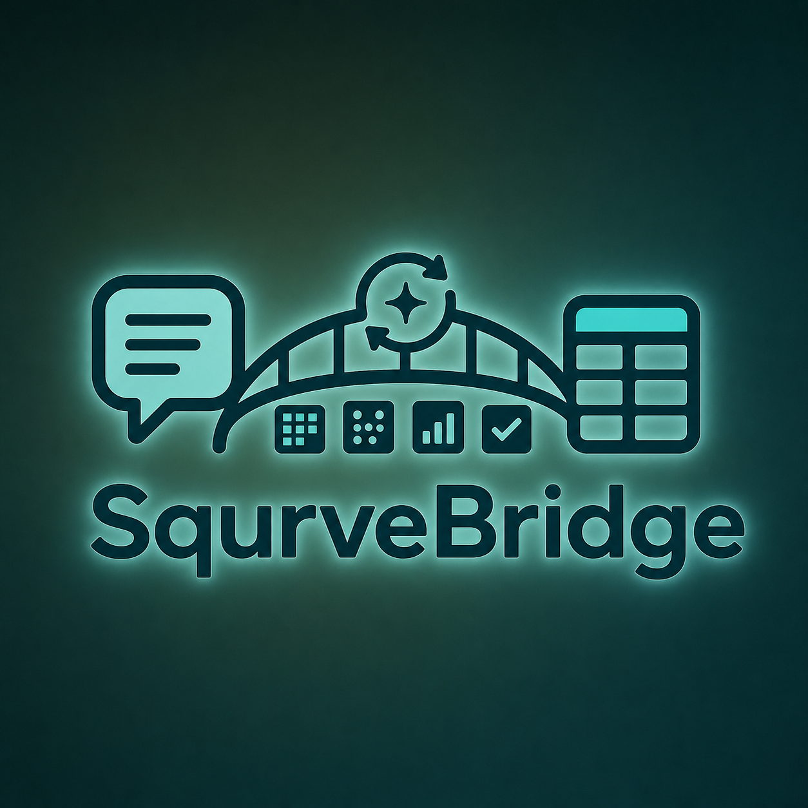
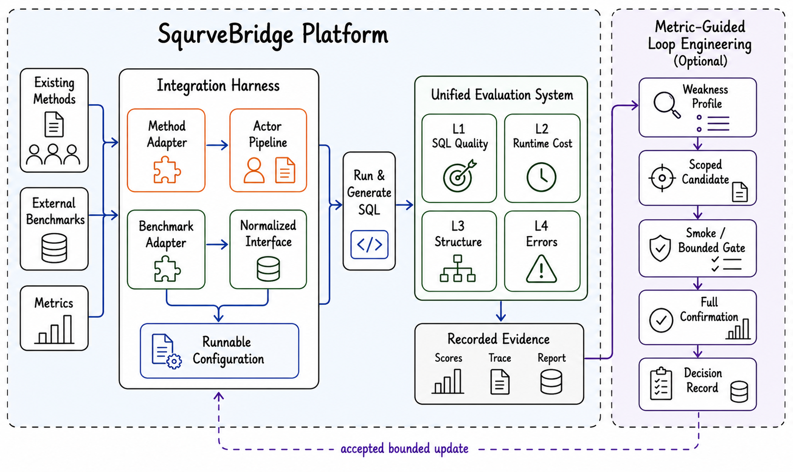

# SqurveBridge

<div align="center">



**Turn released Text-to-SQL methods and databases into reproducible Squrve workflows**

Integrate · Reproduce · Diagnose · Improve

[](https://squrvebridge.vercel.app/)
[](https://huggingface.co/spaces/zmmjjkk/SqurveBridge)
[](https://www.python.org/)
[](LICENSE)
[](https://github.com/Satissss/Squrve)

[Features](#features) · [Demo](#demo) · [Quick Start](#quick-start) · [Architecture](#architecture) · [Docs](#documentation)

</div>

---

## About

SqurveBridge reconstructs released Text-to-SQL methods as inspectable **Squrve Actors**, normalizes benchmarks behind one contract, runs method–database pairs through reproducible configs, and persists sample- and stage-level evidence.

It is **not** another Text-to-SQL model. It is the bridge between released methods, new databases, and trustworthy evaluation — built on upstream [Squrve](https://github.com/Satissss/Squrve), with an embedded [Pi](https://github.com/earendil-works/pi) Agent as the Demo runtime kernel (`pi/`, loaded via `demo/pi_agent_bridge.mjs`; project `skills/` are the capability SSOT).

```text
candidate → integrate → reproduce config → run → scores + traces → optional improve
```

## Features

| Capability | What it provides |
| --- | --- |
| Native method integration | Released logic as Squrve Actors — not opaque repo wrappers |
| Benchmark adapters | Schema, questions, SQL, and splits behind one interface |
| Reproduce configs | Method + benchmark + sampling + evaluation in one file |
| Four-layer evidence | SQL quality, cost, structure, and error attribution |
| Pi Agent kernel | Embedded open-source Agent that loads Skills and drives Demo chat |
| Interactive workspace | Compose runs, inspect evidence, and chat with the agent |
| Optional Meta-Evo | Bounded improvement against recorded baselines |

## Demo

- **Live Demo** — [huggingface.co/spaces/zmmjjkk/SqurveBridge](https://huggingface.co/spaces/zmmjjkk/SqurveBridge)
- **Project site** — [squrvebridge.vercel.app](https://squrvebridge.vercel.app/)
- Hosted packaging notes: [deploy/huggingface/README.space.md](deploy/huggingface/README.space.md)
- Local Demo guide: [demo/README_EN.md](demo/README_EN.md)

**Local workspace:**

```bash
./demo/start.sh
# open http://127.0.0.1:5173
```

Local mode binds to `127.0.0.1` with full coding tools for Pi. The public Space is read-only for agent tools, blocks uploads and live evaluation writes, and keeps visitor credentials in session memory only — never in score bundles or runtime configs on disk.

## Quick Start

**Requirements:** Python 3.11+, Git LFS, Node.js 20+ (for the interactive Demo), and an API key for the provider used by the chosen reproduce config.

```bash
git lfs install
git lfs pull --include="benchmarks/packages/*.zip"

python3 -m venv .venv && source .venv/bin/activate
pip install -r requirements.txt

python tools/benchmarks.py verify-archives
python tools/benchmarks.py install spider

cp .env.example .env   # add provider keys — never commit .env
python reproduce/run.py spider c3sql
```

Deterministic release gate (no LLM calls):

```bash
python tools/release_check.py --skip-history
```

Remote model calls may incur cost. Full walkthrough: [Getting Started](docs/GETTING_STARTED.md).

## Usage

### Run a method–benchmark pair

```bash
python reproduce/run.py <benchmark> <method>
# example:
python reproduce/run.py spider c3sql
```

Configs live under `reproduce/configs/<benchmark>/<method>.json`. The CLI and Demo job manager share the same runner, so terminal and browser runs do not diverge.

### Integrate a candidate (method or database)

Use the Skill pipeline (via Pi Demo chat or an external harness):

1. **candidate-reader** — inspect the candidate and produce a manifest  
2. **integration-pipeline** — native Actor / benchmark adapters + reproduce config  
3. **run** — debug, smoke, then full evaluation with evidence  

See [harness/README.md](harness/README.md) and `skills/*/SKILL.md`. Method work defaults to a feature branch or worktree; see [CONTRIBUTING.md](CONTRIBUTING.md).

### Inspect evidence

Published, checksummed examples: [evidence/](evidence/). Local runs write under `workspace/` (gitignored). Claims should cite verified score bundles, not ephemeral paths.

## Architecture

Two runtime planes share one set of project contracts:

- **Evaluation plane** — Text-to-SQL workflows, metrics, and evidence  
- **Agent plane** — embedded Pi + Skills for inspect / integrate / improve  

The Demo App exposes both in one browser UI; credentials and auth stay separate.

<div align="center">

</div>

```text
  CLI / Demo App / Pi chat
            │
            ▼
  reproduce configs · skills · templates · benchmarks
            │
            ▼
  Router → DataLoader → Engine → Task graph → Actors
            │
            ▼
  stage metrics → score bundle → evidence / Meta-Evo
```

| Module | Role |
| --- | --- |
| `Router` | Merge system defaults with a reproduce config |
| `DataLoader` | Normalize benchmark rows, schemas, DBs, and LLM adapters |
| `Engine` | Build and run checkpoint-aware Task graphs |
| `Actors` | Stage roles (reduce, parse, generate, optimize, …) |
| `Evaluation` | Stage/final metrics, diagnostics, four-layer scores |
| `Persistence` | Redacted configs, score bundles, eval-store |

The reproduce config is the main seam: both CLI and Demo invoke the same runner with that contract.

## Project Structure

```text
core/           Squrve runtime: Router, Engine, Tasks, Actors, LLM/DB adapters
reproduce/      Configs, CLI/batch runners, metrics, checkpoints, Meta-Evo
benchmarks/     Git LFS packages and installed benchmark layouts
demo/           Flask API, job manager, Pi bridge, deployment policy
demo-app/       React/Vite interactive workspace
pi/             Vendored Pi Agent kernel (reviewed upstream snapshot)
skills/         Capability contracts (integration, run, Meta-Evo, …)
templates/      Schemas and skeletons for manifests, configs, reports
tools/          Deterministic validation, benchmarks, evidence, release gates
deploy/         Hugging Face Space packaging overlays
evidence/       Published, checksummed example score bundles
tests/          Python and Pi bridge regressions
workspace/      Runtime data only (gitignored except README)
```

Runtime layout under `workspace/` (override with `SQURVE_WORKSPACE_DIR`):

```text
workspace/
  sessions/    # Demo jobs, logs, Pi agentDir
  runs/        # reproduce intermediates + checkpoints
  artifacts/   # score bundles, eval-store.sqlite, evolve
  uploads/     # user databases and temp demo data
```

Nothing under `workspace/` is published. See [docs/REPRODUCIBILITY.md](docs/REPRODUCIBILITY.md).

## Configuration & Security

| Context | How credentials work |
| --- | --- |
| **Local** | Repo-root `.env` (gitignored). Prefer `${ENV:…}` refs in configs. |
| **Hosted Space** | No shared maintainer key. Session credentials stay in memory only. |
| **Artifacts** | API keys are redacted before any config is written to disk. |

Never commit `.env`, provider payloads, or plaintext keys. Security policy: [SECURITY.md](SECURITY.md). Scanners:

```bash
python tools/anonymity_scan.py
python tools/security_scan.py
```

## Development

```bash
# Python regressions
python -m unittest discover -s tests -p 'test_*.py' -v

# Frontend
npm ci --prefix demo-app
npm test --prefix demo-app
npm run build --prefix demo-app

# Full release gate (see CONTRIBUTING for --full)
python tools/release_check.py --skip-history
```

Contribution rules (native Actors, branch isolation, PR gate): [CONTRIBUTING.md](CONTRIBUTING.md).  
Code of conduct: [CODE_OF_CONDUCT.md](CODE_OF_CONDUCT.md).

## Documentation

| Doc | Topic |
| --- | --- |
| [Getting Started](docs/GETTING_STARTED.md) | Install, credentials, first run |
| [Reproducibility](docs/REPRODUCIBILITY.md) | Configs, checkpoints, evidence rules |
| [Benchmarks](docs/BENCHMARKS.md) | Packages, install, verification |
| [Demo guide](demo/README_EN.md) | Local interactive workspace |
| [Hosted Space](deploy/huggingface/README.space.md) | Public Live Demo packaging |
| [Harness](harness/README.md) | Skills, tools, templates, agent workflows |
| [Evidence](evidence/README.md) | Published score bundles |
| [Security](SECURITY.md) · [Contributing](CONTRIBUTING.md) | Policy and contribution |

## License

MIT — see [LICENSE](LICENSE).

Upstream Squrve and integrated methods retain their own attribution; see [THIRD_PARTY_NOTICES.md](THIRD_PARTY_NOTICES.md). Pi is a reviewed vendored snapshot; provenance is recorded in `pi/SQURVEBRIDGE_UPSTREAM.md`.
