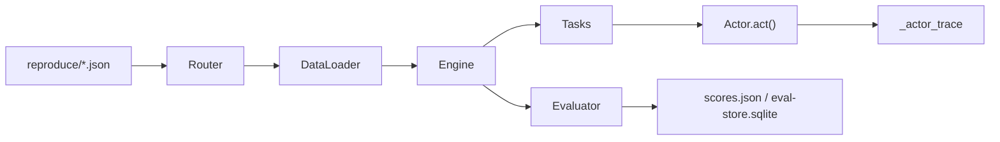

# Squrve 框架

模块化 Text-to-SQL **研究框架**：统一数据加载、多阶段 Actor 流水线、评估与复现。

## 原生重构原则

接入社区 method 时，**不是包装或调用候选源码**，而是：

1. **理解算法**：通过 candidate-reader 深度阅读，提取核心逻辑与数据流
2. **原生重写**：用 Squrve 的 `Base*` 基类、`act()` 签名、Dataset 字段、LLM 工厂重新实现
3. **忠于原理**：保留候选方法的算法思想（prompt 策略、pipeline 阶段、投票/选择逻辑），但代码是全新的 Squrve 原生代码
4. **不依赖源码运行**：新 Actor 不 import 候选仓库的任何模块；候选源码仅作为「算法文档」参考
5. **Squrve 基础设施优先**：LLM 调用走 `self.llm`，schema 走 `self.dataset`，保存走 `self.save_output()`

**候选源码的唯一用途**：理解 prompt 模板、数据流、算法参数。actor-adapter 写出的 `.py` 是**从零构建的 Squrve Actor**。

## 分支隔离

接入时的 Git 策略按 **type** 区分，而非一刀切。

### 对比

| | method | database |
|---|--------|----------|
| 典型改动 | `core/actor/`、Task `load_actor()` 分支、LLM/RAG 工厂、method reproduce config | `benchmarks/<slug>/`、schema 转换、`config/sys_config.json` 注册 |
| 冲突面 | 与所有已有 method 共享 Actor/Task/工厂 | 多为独立数据目录与 benchmark 条目 |
| **`main` 上开发** | **默认禁止** method Actor；**用户可选 Main 模式** | **允许** |
| 推荐分支 | feature branch / worktree；或用户选 Main | 无需（除非要改 core） |

### Method：Branch + Worktree 混合模式

method 接入**默认不在 `main` 上直接开发**。先与用户确认 **Branch / Worktree / Main** 模式，再创建分支/worktree 或登记 Main。

| 场景 | 方式 | 示例 |
|------|------|------|
| **多方向并行** | worktree + branch | `git worktree add ../squrve-finsql -b feature/finsql-20260629 main` |
| **单一方向持续调试** | feature branch | `git checkout -b feature/finsql-debug-20260629` |
| **用户选 Main 模式** | 在 main 开发（须 `set-dev-mode --mode main`） | `artifact_state.py set-dev-mode --slug finsql --mode main` |
| **新路线 / 新实验** | 从最新 `main` **新建** branch/worktree | `feature/finsql-rewrite-20260630` |

约定：

- 分支名：`feature/<method>/<timestamp>`、`feature/<method>-debug-<date>`；兼容 `integrate/<slug>`
- **同一方向**内修 bug、调 prompt、改 config、跑同一 benchmark → **可留在同一 feature branch**
- **新方向**、大版本重写、并行比较、branch 混乱 → **必须新开** branch/worktree
- `main` 仅接收已跑通且评估出分的 method 合并

工具门控：`artifact_state.py check-branch --type method`；`complete-reader`、`gate`、`gate-adapter(method)` 在 `main` 上硬失败。

详见 [git-experiment-isolation.md](git-experiment-isolation.md)。

### main 与 integrate/<slug> 职责

| 分支 | 承载 | 不承载 |
|------|------|--------|
| **`main`** | Harness（`skills/`、`tools/`）、平台评估（`reproduce/metrics/`、`token_logger`、scores/workflow trace/eval-store 组装）、database 接入、Squrve 上游 core | 新 method 的 Actor、Task 注册、method reproduce config |
| **`integrate/<slug>`** | **`main` 最新** + 该 method 全部接入代码与 `reproduce/configs/<dataset>/<slug>.json` | 其他 method |

workflow：

```bash
# 平台开发（harness / 评估）— 始终在 main
git checkout main

# method 接入 / /run — 先确认 Branch 或 Worktree 模式，再基于最新 main 建分支
git checkout main && git pull
git checkout -b feature/<slug>-debug-20260629   # 单方向调试
# 或: git worktree add ../squrve-<slug> -b feature/<slug>-20260629 main  # 并行

/candidate-reader → /integration-pipeline → /run（debug 运行问题、跑通整条 config）
```

**当前 method 分支**（method 代码仅存在于对应分支，不合入 main core）：

| 分支 | method | reproduce config |
|------|--------|------------------|
| `integrate/c3sql` | C3SQL 三阶段（Reducer → Parser → Generator） | `reproduce/configs/spider/c3sql.json` |
| `integrate/finsql` | FinSQL | （见该分支） |

> Legacy method（LinkAlign、DINSQL、MACSQL 等）在分支策略引入前已位于 main，后续新 method 一律走 `integrate/<slug>`。

### Database：可在 main 直接接入

database 接入以**增量数据与注册**为主，默认不碰 Actor/Task，可在 **`main` 上直接完成**：

```
/candidate-reader → /integration-pipeline → （可选）/run 验证注册
```

仍须遵守最小侵入：默认只新增 benchmark 与 sys_config 注册。以下情况改走 `integrate/<slug>` 分支：

- 需要扩展 `core/db_connect.py`（db_backend）
- 需要修改 Engine / Router / Evaluator / DataLoader
- 用户明确要求隔离接入

## 仓库布局

```
Squrve/
├── config/sys_config.json         # benchmark 注册
├── benchmarks/<slug>/             # 数据集
├── core/                          # 核心（见下）
├── reproduce/
│   ├── run.py                     # 运行 + 评估入口
│   ├── template.json              # config 模板
│   └── <dataset>-<method>.json    # 实验配置
├── files/                         # 运行时产物
└── artifacts/<slug>/              # harness 产物
```

## 核心模块

| 模块 | 路径 | 职责 | 接入时可改？ |
|------|------|------|------------|
| **Router** | `core/base.py` | 解析 reproduce config | **禁止** |
| **DataLoader** | `core/data_manage.py` | 数据/LLM/embedding/RAG 加载 | 可扩展 provider/函数 |
| **Engine** | `core/engine.py` | Task 调度执行 | **禁止** |
| **Evaluator** | `core/evaluate.py` | EX 等指标 | **禁止** |
| **Task** | `core/task/meta/*.py` | `load_actor()` 按类型名实例化 Actor | workflow-adapter 增分支 |
| **Actor** | `core/actor/<layer>/` | `act()` 实现算法 | actor-adapter 新增文件 |

## 运行时流水线



1. `run.py` 加载 config → Router 解析 → DataLoader 加载数据
2. Engine 按 `exec_process` 调度 Task → Task 实例化 Actor → `act()` 写 dataset 字段
3. Actor/Task 自动记录 `_actor_trace`（actor、stage、输入输出摘要、row_delta、耗时、错误）
4. 预测 SQL → `files/pred_sql/` → Evaluator 输出 scores、workflow trace、SQL feature/QVT 切片与 eval-store

## 评估系统

`reproduce/run.py` 跑通后写入 `artifacts/<dataset>-<method>-YYYYMMDD-HHMMSS/scores.json` 与 `artifacts/eval-store.sqlite`。

| 层级 | 内容 |
|------|------|
| Final | EX, EM, SF1, SC, VES, RVES, CF1, FD |
| Stage | `stage_metrics`，由各 `task_meta[].eval_type` + `dataset_save_path` 计算 |
| Workflow | `workflow_trace`，按 reducer/parser/generator/selector 递归归因 |
| SQL Feature | 16 维 SQL feature、feature delta、`by_sql_feature`、`by_scenario` |
| Consistency | QVT：同 gold SQL 多问法稳定性与 flip rate |
| Runtime | `_actor_trace`、token、latency、row_delta |

接入新 method 时，config 必须为每个 stage 设置 `dataset_save_path` 与合适的 `eval_type`，否则只能得到 final 指标，无法定位 actor 瓶颈。

## Actor 层（8 + Nest）

按 **I/O 语义** 划分，candidate-reader 必须按数据流映射。

| Layer | 基类 | config 键 | 产物 |
|-------|------|-----------|------|
| Generate | `BaseGenerator` | `generate_type` | `pred_sql` |
| Parse | `BaseParser` | `parse_type` | `schema_links` |
| Reduce | `BaseReducer` | `reduce_type` | 缩减 schema |
| Scale | `BaseScaler` | `scale_type` | 多候选 sql |
| Decompose | `BaseDecomposer` | `decompose_type` | `sub_questions` |
| Optimize | `BaseOptimizer` | `optimize_type` | 精修 sql |
| Select | `BaseSelector` | `select_type` | 择优 sql |
| Agent | `BaseAgent` | `agent_type` | agent 输出 |
| Nest | `ComplexActor` | — | 组合编排 |

`act()` 签名：`(self, item, schema=None, schema_links=None, ..., **kwargs)`  
注册 5 步见 [actor-registration-chain.md](actor-registration-chain.md)。

## 扩展点

| 能力 | 位置 | adapter |
|------|------|---------|
| LLM provider | `core/data_manage.py` / `core/llm/` | llm-provider |
| Embedding | `get_hf_embedding_model()` | embedding |
| RAG / 索引 | `RagPipeLines` | retrieval |
| Few-shot | `add_few_shot()` | retrieval |
| External | `add_external()` | external-knowledge |
| Actor | `core/actor/<layer>/` | actor |
| Task 分支 | `core/task/meta/` + `__init__.py` | workflow |

## 配置分层

| 层 | 文件 | 作用 |
|----|------|------|
| 系统 | `config/sys_config.json` | benchmark 列表 |
| 实验 | `reproduce/configs/<dataset>/<method>.json` | 本次 run 全部参数 |
| 模板 | `reproduce/configs/template.json` | 新 config 占位符 |

`data_source`: `<benchmark>:<sub_id>:`  |  `schema_source`: `<benchmark>:<sub_id>`

第三段 filter 规则：
- 空（`spider:dev:`）→ 全量
- 纯数字（`BookSQL:val:20`）→ 取前 N 条（head limit）
- 命名 filter（`spider:dev:has_label`）→ `db_size` / `difficulty` / `has_label` / `limit-N` 等
- smoke 采样也可用 `dataset.random_size`（随机，非 head）

## Reader 探索范围

`candidate-reader` 的 Squrve subagent 须从**仓库根**递归阅读整个仓库（含 `skills/`、
`tools/`、`benchmarks/` 结构），在 `squrve-inventory.md` 中列出扩展点的 **file:line**，
供 manifest 填写 `needs_*`。详见 [reader-recursion-contract.md](reader-recursion-contract.md) §1.1。
